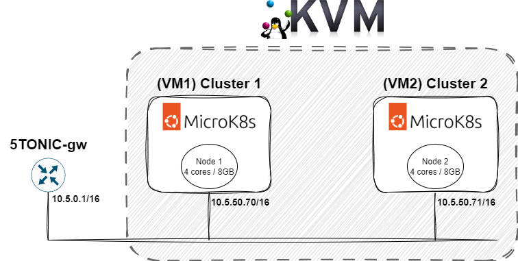

# DLT Service Federation using Kubernetes

## Introduction

Description of the repo.

**Author:** Adam Zahir Rodriguez


## Scenario setup



The configuration of the simulation:
- 2 VMs containing Docker and MicroK8s
- Both interconnected in bridge mode within KVM
- Both VMs have access to a blockchain node

## Prerequisites

Before getting started, make sure you have the following installed on your system:

- [Microk8s](https://microk8s.io/#install-microk8s)
- [Docker](https://docs.docker.com/engine/install/ubuntu)
- [Docker Compose](https://docs.docker.com/compose/install/linux)

# Installation

1. Clone the repository:
```
git clone git@github.com:adamzr2000/dlt-federation-kubernetes.git
```

2. Build Docker Images:
Follow these steps to build the necessary Docker images:

2.1. Navigate to the `docker-images` directory in your project.
```bash
cd docker-images
```

2.2. For each of the following subdirectories (`dlt-node`, `truffle`, `eth-netstats`), execute the `build.sh` script. 
```bash
cd dlt-node
./build.sh
cd ../truffle
./build.sh
cd ../eth-netstats
./build.sh
```

3. Install the necessary python3 dependencies:
```bash
pip install -r requirements.txt
```

# DLT Network Setup

Firstly, we will create a DLT network using Docker containers and Geth (Go-Ethereum) software. The network will consist of two nodes, each connected to a bootnode to facilitate their association with one another.

1. Initialize the Ethereum network:

**(VM1)** Navigate to the `dlt-network-docker` directory and start the network setup:

Note: Please make sure to modify the IP addresses in the `.env` file according to your setup before executing the script. For example, replace 10.5.50.70 with the IP address of your VM1 and 10.5.50.71 with the IP address of your VM2.

```bash
./start_dlt_network.sh
```

2. Join the Ethereum network

**(VM2)** To join the network from a second node, navigate to the `dlt-network-docker` directory and execute:

```bash
./join_dlt_network.sh node2
```

## Verifying Node Association

After starting the Ethereum network, you can verify that the nodes have associated correctly by executing the following commands:
```bash
docker exec -it node1 geth --exec "net.peerCount" attach ws://<vm1-ip-address>:3334
```

```bash
docker exec -it node2 geth --exec "net.peerCount" attach ws://<vm2-ip-address>:3335
```

Each command should report `1 peer`, indicating that the nodes have successfully connected to each other.


Access the [eth-netsats](http://<vm1-ip-address>:3000) web interface for additional information.

4. Stop the Network:

**(VM1)** When needed, use the following command to stop the network:

```bash
./stop_dlt_network.sh
```

# Testing

1. **(VM1 or VM2)** Deploy the Federation Smart Contract to the Blockchain Network:
```bash
cd smart-contracts
./deploy.sh 
```

2. **(all)** Start the web server of the API 

Note: Before starting the web server, ensure to export the Kubernetes cluster configuration file for each VM. Navigate to the `k8s-cluster-config` directory and execute `./export_k8s_cluster_config`, indicating 

```bash
./start_app.sh
```

Consumer API documentation at: [http://10.5.50.70:8000/docs](http://10.5.50.70:8000/docs)


Provider API documentation at: [http://10.5.50.71:8000/docs](http://10.5.50.71:8000/docs)


## Kubernetes configuration

**Activate Metallb in the K8s cluster:**

*MetalLB is an open-source, software-based load balancer solution for Kubernetes clusters. It provides a network load balancing functionality by enabling the assignment of external IP addresses to services running within the cluster* 

1. Configure MetalLB: After installing Microk8s, you need to configure metallb with the appropriate address pool.
```bash
microk8s enable metallb

<Enter IP address range>
(e.g. 10.5.50.80-10.5.50.90)
```

2. Verify the installation: Use the following commands to check if the MetalLB driver is running:
```
kubectl get pods -n metallb-system
kubectl get configmap -n metallb-system
```
